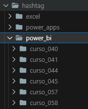
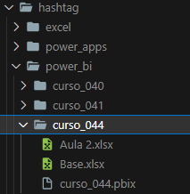

Olá, meu nome é Pedro Heeger e seja muito bem vindo por ter chegado até aqui. Abaixo estão minhas redes sociais e meu currículo esta dispoível no link do GitHub Pages. Este é o meu repositório principal e aqui você saberá mais sobre mim e sobre minha conta no GitHub. 

<a name="item0"><h1>Summary</h1></a>
1. <a href="#item1">Main Repository</a> 
2. 

<a href="#item2">About Me</a>

   2.1. <a href="#item2.1">Phase 1 - Civil Engineering</a> 
   2.2. <a href="#item2.2">Phase 2 - Getting Started in Technology</a> 
   2.3. <a href="#item2.3">Phase 3 - My First Bootcamps</a> 
   2.4. <a href="#item2.4">Phase 4 - Organization of Studies</a> 
3. 

<a href="#item3">My GitHub Account</a>

    3.1. <a href="#item3.1">Profile Repository (pedroheeger)</a> 
    3.2. <a href="#item3.2">Main Repository (main)</a> 
    3.3. <a href="#item3.3">Study Repositories</a>

4. <a href="#item4">Resume</a>
5. 

<a href="#item5">Certificate</a>

   5.1. <a href="#item5.1">Technology Certificate</a> 
   5.2. <a href="#item5.2">Language Certificate</a>

6.  <a href="#item6">Reports and Dashboards</a>   
7.  <a href="#item7">Read Books</a> 
8. 

<a href="#item8">All Skills Already Used</a>

   8.1. <a href="#item8.1">Programming Language</a> 
   8.2. <a href="#item8.2">Database Management System (DBMS)</a> 
   8.3. <a href="#item8.3">Cloud</a> 
   8.4. <a href="#item8.4">Big Data</a> 
   8.5. <a href="#item8.5">Operating System (OS)</a> 
   8.8. <a href="#item8.6">Business Inteligence (BI)</a> 
   8.8. <a href="#item8.8">Other Languages</a> 
   8.8. <a href="#item8.8">Repository and Versioning</a> 
   8.9. <a href="#item8.9">Integrated Development Environment (IDE)</a> 
   8.10. <a href="#item8.10">Library and Framewoks</a> 
   8.15. <a href="#item8.15">Others</a>

9. <a href="#item9">Study Repository</a>
10. 

<a href="#item10">Main Projects</a>

    10.1. <a href="#item10.1">Bootcamps (Study Repository)</a> 
    10.2. <a href="#item10.2">Course (Study Repository)</a>

---

<a name="item1"><h2>1. Main Repository</h2></a>
[Back to summary](#item0)   

Este é o meu repositório principal, onde apresento toda a organização da minha conta no GitHub, falo um pouco mais sobre mim, explico sobre os meus repositórios, disponibilizo meu currículo em um website, exibo as certificações que conquistei, os certificados dos eventos que participei, as línguas que domino e as ferramentas que já utilizei.

Para construção desse repositório fiz um fork de um repositório já existente da plataforma **Digital Innovation One - DIO** (*digitalinnovationone/resume*) que contém um template em **HTML** e **CSS** para criação de um currículo online, sendo disponibilizado em um link hospedado no **GitHub Pages**. Para acessar meu currículo online, [clique aqui](https://pedroheeger.github.io/main/).

O repositório original é apenas para montagem do currículo online, mas resolvi adaptá-lo para utilizar como repositório principal e acrescentar diversas outras informações sobre mim e minha conta no GitHub. Apenas utilizei, do repositório original, o arquivo de template em **HMTL** para criação do meu currículo online.

---
 
<a name="item2"><h2>2. About Me</h2></a>
[Back to summary](#item0)   

Olá novamente, como já sabe meu nome irei falar um pouco mais sobre mim. Atualmente tenho 30 anos e moro na cidade onde eu nasci e cresci, Salvador-BA e sou graduado em **Engenharia Civil** pela Universidade Católica do Salvador e formado em Engenharia de Dados pela **SoulCode Academy**. 

<a name="item2.1"><h3>2.1. Phase 1 - Civil Engineering</h3></a>
[Back to item 2](#item2)   

Iniciei minha carreira profissional, em Fevereiro de 2019, ainda durante a faculdade, como assistente administrativo em uma empresa de fiscalização de obras contratada pela empresa de água e saneamento de Salvador para fiscalizar a construtora contratada que realizou uma obra de ampliação de um centro de reservação de abastecimento de água de minha cidade. Nesta obra foi construído um reservatório apoiado, um reservatório elevado, uma estação elevatória, toda a rede de interligação e a urbanização deste centro de reservação.

Após conclusão da obra e com minha graduação concluída, em Junho de 2021, fui contratado pela construtora, em Outubro de 2021, a qual eu tinha fiscalizado, para uma outra obra. Desta vez, uma obra de complementação da ampliação do sistema de esgotamento sanitário de Salvador para as bacias do Trobogy e Cambunas. 

Durante esse período, foi o momento em que comecei a pensar em realizar uma transição de carreira. Eu gostava muito da engenharia, gostava de onde eu trabalhava, porém não me sentia realizado, não sentia que era isso que eu queria para o resto da minha vida, sentia que eu poderia muito mais. Como desde de pequeno gostava de computador, sempre gostei muito de excel, desde os 11 anos que eu pesquisava como montar planilhas de copa do mundo utilizando macros, comecei a me questionar porque não aprender tecnologia? o porque não aprender uma linguagem de programação?

<a name="item2.2"><h3>2.2. Phase 2 - Getting Started in Technology</h3></a>
[Back to item 2](#item2)   

Foi nesse momento que ocorreu a virada de chave. Passei a buscar na internet, ler sobre o tema, e vi que a perspectiva do mercado para essa área estava muito boa e só iria aumentar. Então comecei a receber sugestões de cursos de **Python**, e fiquei encantado com aquilo até o momento que tomei uma grande decisão na minha vida, talvez uma das maiores. Decidi que iria sair do meu emprego e iria estudar tecnologia. 

No final de Agosto de 2021, me desliguei da empresa onde trabalhava e logo surgiu para mim um processo seletivo para realização de um bootcamp de **Engenharia de Dados com Python e Google Cloud** numa edtech chamada **SoulCode Academy**. Analisei sobre o processo e vi que não precisava de experiência, como não sabia nada ainda desse universo que é a tecnologia, só sabia excel e muito pouco para o que eu achava que sabia, decidi participar. Infelizmente, não passei para fase de seguinte, mas não me desanimei, pois minha jornada nessa área só estava a começar.

Como eu tinha já pesquisado algumas coisas sobre tecnologia, descobri sobre a área de dados e banco de dados e sobre linguagem de programação, mais precisamente sobre o Python, então comecei a salvar alguns links de vídeos, cursos e plataformas de estudo sobre o tema e pensei vou estudar esses materiais e depois procuro um bootcamp para realizar. Então surgiu uma nova turma para o mesmo bootcamp de dados da **SoulCode Academy**, decidi tentar novamente e passei não só para fase seguinte, como para participar do bootcamp.

<a name="item2.3"><h3>2.3. Phase 3 - My First Bootcamps</h3></a>
[Back to item 2](#item2)   

No final de Outubro de 2021, iniciei o bootcamp e o aprendizado foi incrível. Para quem não tinha conhecimento nenhum foi super esclarecedor, me fez entender as áreas da tecnologia, coisas básicas que eu não sabia, desde sistemas operacionais com o uso do Linux, passando por conhecimento de redes, linguagem de programação, banco de dados, comunicação entre a linguagem e o banco, conhecimentos de big data e até chegar a clouds. Foi um excelente ponta pé de partida para eu entender as áreas e como as coisas funcionam no mundo da tencologia. A partir desse bootcamp, pesquisar e procurar os assuntos sobre o tema se tornou muito mais fácil. O bootcamp foi intensivo e durou por três meses, sendo concluido em Fevereiro de 2022. Existe uma pasta específica sobre esse bootcamp em um dos meus repositórios, caso queira saber mais [clique aqui]().

Após a conclusão do bootcamp, fiz outros cursos e fui pesquisando mais sobre os assuntos. Até que em Outubro de 2022, conheci uma plataforma chamada **DIO - Digital Innovation One**, que possui diversos cursos e programas específicos de estudos bem completo. Nessa época, realizei o meu primeiro bootcamp na plataforma que foi o **Geração Tech Unimed-BH - Ciência de Dados** e conheci melhor a área da ciência de dados e, mais uma vez, fiquei encantado. Conclui o bootcamp no final de Dezembro desse mesmo ano.

<a name="item2.4"><h3>2.4. Phase 4 - Organization of Studies</h3></a>
[Back to item 2](#item2)

Em 2023, percebi que eu precisava me organizar, que eu tinha muito material, muito conteúdo, mas sentia que estava tudo bagunçado e precisava organizar. Foi então que comecei e ainda estou num processo de organizar todo meu material de estudo, começando do mais básico, no caso o Excel, que agora posso dizer que tenho conhecimento em Excel avançado, passando pelas três áreas de Dados (Análise de Dados, Engenharia de Dados e Ciência de Dados) com objetivo de obter o conhecimento sólido sobre esses temas.

No momento atual, estou realizando cursos e aulas, organizando materiais que salvei durante esse tempo, seguindo uma sequência, revisando e ampliando meus conhecimentos sobre as áreas que conheci. Meu foco atual é a Engenharia de Dados, mas simpatizo muito com a Ciência de Dados. Também tenho iniciado outros Bootcamps na plataforma da **DIO**, meu objetivo é concluí alguns cursos e bootcamps dessa plataforma para fortalecer minha base de conhecimento e conquistar algumas certificações.

---

<a name="item3"><h2>3. My GitHub Account</h2></a>
[Back to summary](#item0) 

Na minha conta do GitHub existe cinco repositórios e irei explicar agora como eles funcionam. Todos esses repositórios existem remotamente (GitHub) e localmente (minha maquina). Na minha maquina eles são salvos em uma pasta do **Google Drive** de nome **4_Proj**, já que formam juntos todos os meus projetos que realizei e a estrutura do meu perfil do GitHub.

Nem todos os arquivos dentro das sub-pastas dos repositórios serão disponibilizados no GitHub, porém todo conteúdo está armazenando no **Google Drive** pessoal. O objetivo é diminuir a quantidade de arquivos armazenados que não são versionados como arquivos de Excel (CSV), Power BI, PowerPoint e de imagens. São versionados apenas arquivos relavantes e arquivos de README explicando o conteúdo do repositório e das suas sub-pastas, que são os projetos desenvolvidos.

<a name="item3.1"><h3>3.1. Profile Repository (**pedroheeger**)</h3></a>
[Back to item 3](#item3)   

O primeiro repositório é o **pedroheeger** que é o repositório de perfil do GitHub. Nele só existe um único arquivo **markdown** de README para construção do perfil no GitHub. No perfil é apresentado uma breve introdução sobre mim, as minhas redes sociais, os cartões de status do GitHub e principais linguagens utilizadas, as minha habilidades mais utilizadas, um card direcionando para esse repositório, que é o repositório principal e outros cards direcionando para meus repositórios de estudos, além de links direto para os projetos que ficam nas sub-pastas dos meus repositórios e links direto para alguns dashboards e reports online.

<a name="item3.2"><h3>3.2. Main Repository (**main)**</h3></a>
[Back to item 3](#item3) 

O segundo repositório é este, que como já foi dito no início deste arquivo, é o meu repositório principal, onde apresento toda a organização da minha conta no GitHub, falo um pouco mais sobre mim, explico sobre os meus repositórios, disponibilizo meu currículo em um website, exibo as certificações que conquistei, os certificados dos eventos que participei, as línguas que domino, as ferramentas que já utilizei e os mesmos conteúdos do repositório de perfil de forma mais ampliada.

<a name="item3.3"><h3>3.3. Study Repositories</h3></a>
[Back to item 3](#item3) 

Os meus repositórios de estudos são organizados em três repositórios. O primeiro é o **boot** que armazena todos os bootcamps que realizei divididos em sub-pastas. O segundo repositório é o **course** que guarda todos os cursos que realizei, também divididos em sub-pastas. O terceiro é o **video** armazenando todas as vídeo-aulas que realizei, divididos em sub-pastas.

Os bootcamps são um conjunto de cursos, as vezes separados por módulos. Já os cursos são um conjunto de vídeos, também podendo ser separados por módulos. Por fim, as vídeo-aulas são a unidade mais básica do meu estudo.

##### Subdivisions of Repositories
Esses três repositórios são divididos em níveis de sub-divisões de pastas. Vamos entender cada nível agora.

- Primeiro Nível de Pastas: O primeiro nível de pastas dividi o repositório em sub-pastas para cada plataforma diferente onde realizei o estudo (ex.: DIO, Microsoft Learn, Hashtag, Soul Code Academy).

<figure>
     
    <figcaption>Primeiro Nível de Pastas em um repositório.</figcaption>
</figure>
 

- Segundo Nível de Pastas: Após a primeira sub-divisão, em alguns casos é necessário a criação de um segundo nível de pastas, quando se tem muitos estudos sobre diferentes software/assuntos. Por tanto, a sub-pasta da plataforma é sub-dividida por nome do software ou assunto (python, power_bi, mysql, javascript, analise_dados, etc.).

<figure>
     
    <figcaption>Segundo Nível de Pastas em um repositório.</figcaption>
</figure>
 

- Terceiro Nível de Pastas: Por fim, o terceiro nível pasta sub-dividi a sub-pasta do software/assunto (segundo nível) ou a sub-pasta da plataforma (primeiro nível) em um nome específico com um número de ordem para controle (boot_01, boot_02, course_010, course_029, aula_135, aula_223). Esta sub-pasta conterá todo material do estudo que está sendo realizado. O material pode ser arquivos ou outras pastas, nos casos que seja necessário, dentro de um mesmo estudo, separar por módulos.

<figure>
     
    <figcaption>Terceiro Nível de Pastas em um repositório.</figcaption>
</figure>
 

<figure>
     
    <figcaption>Pasta com todo material do estudo.</figcaption>
</figure>
 

---

<a name="item4"><h2>4. Resume</h2></a>
[Back to summary](#item0) 

Como dito anteriormente, este repositório foi originado de um fork de um repositório já existente da plataforma **Digital Innovation One - DIO** (*digitalinnovationone/resume*) que contém um template em **HTML** e **CSS** para criação de um currículo online, sendo disponibilizado em um link hospedado no **GitHub Pages**. Acesse o meu currículo [aqui](https://pedroheeger.github.io/main/).

---

<a name="item5"><h2>5. Certificate</h2></a>
[Back to summary](#item0)

<a name="item5.1"><h3>5.1. Technology Certificate</h3></a>
[Back to item 5](#item5)

Neste repositório é disponibilizado uma sub-pasta com todos os certificados que obtive durante o meu processo de aprendizagem. Na sub-pasta está contida os certificados de conclusão de cursos, certificados de conclusão de bootcamps, certificações especiais, entre outros. Para acessá-la, [clique aqui](./cert_ti/).

<a name="item5.2"><h3>5.2. Language Certificate</h3></a>
[Back to item 5](#item5)

Aqui também é disponibilizado uma sub-pasta com todos os certificados referentes aos línguas que aprendi. Para acessar essa sub-pasta, [clique aqui](./cert_languages/).

---

<a name="item6"><h2>6. Reports and Dashboards</h2></a>
[Back to summary](#item0)

Neste repositório é disponibilizado, em uma sub-pasta, todos os reports e dashboards (relatórios e paineis) realizados nos projetos desenvolvidos em todos os repositórios de estudos. Para acessá-la e conferir o conteúdo, [clique aqui](./report/).

---

<a name="item7"><h2>7. Read Books</h2></a>
[Back to summary](#item0)

- Começando com Linux: Comandos, serviços e administração - Casa do Código

---

<a name="item8"><h2>8. All Skills Already Used</h2></a>
[Back to summary](#item0) 

<a name="item8.1"><h3>8.1. Programming Language</h3></a>
[Back to item 8](#item8)

    
    

<a name="item8.2"><h3>8.2. Database Management System (DBMS)</h3></a>
[Back to item 8](#item8)

    
    

    
    

<a name="item8.3"><h3>8.3. Cloud</h3></a>
[Back to item 8](#item8)

    
    
    

<a name="item8.4"><h3>8.4. Big Data</h3></a>
[Back to item 8](#item8)

    
    

<a name="item8.5"><h3>8.5. Operating System (OS)</h3></a>
[Back to item 8](#item8)

    
    

    
    

<a name="item8.6"><h3>8.6. Business Inteligence (BI)</h3></a>
[Back to item 8](#item8)

    
    

<a name="item8.7"><h3>8.7. Other Languages</h3></a>
[Back to item 8](#item8)

    
    
    

<a name="item8.8"><h3>8.8. Repository and Versioning</h3></a>
[Back to item 8](#item8)

    
    

<a name="item8.9"><h3>8.9. Integrated Development Environment (IDE)</h3></a>
[Back to item 8](#item8)

    
    
    
    
    

<a name="item8.10"><h3>8.10. Library and Framewoks</h3></a>
[Back to item 8](#item8)

    
    
    
    

<a name="item8.15"><h3>8.15. Others</h3></a>
[Back to item 8](#item8)

    
    
    
    

---

<a name="item9"><h2>9. Study Repository</h2></a>
[Back to summary](#item0) 

These are my study repositories, where I create my specific projects for each study I carry out.

---

<a name="item10"><h2>10. Main Projects</h2></a>
[Back to summary](#item0) 

These are my main projects from my repositories.

<a name="item10.1"><h3>10.1. Bootcamps (Study Repository)</h3></a>
[Back to item 10](#item10)

- <a href="https://github.com/PedroHeeger/boot/tree/main/dio/linux/boot_003">boot_003 (Linux do Zero)   </a>

<a name="item10.2"><h3>10.2. Course (Study Repository)</h3></a>
[Back to item 10](#item10)

- <a href="https://github.com/PedroHeeger/course/tree/main/hashtag/power_bi/curso_041">curso_041 (Intensivão de Power BI 2023)   </a>

- <a href="https://github.com/PedroHeeger/course/tree/main/simplifica_trein/power_bi/curso_043">curso_043 (Simplifica Power Excel)   </a>

- <a href="https://github.com/PedroHeeger/course/tree/main/xperiun/power_bi/curso_048">curso_048 (Minicurso Power BI Experience)   </a>

- <a href="https://github.com/PedroHeeger/course/tree/main/xperiun/power_bi/curso_051">curso_051 (Desafio Missão ZERO - Bootcamp HPN)   </a>

- <a href="https://github.com/PedroHeeger/course/tree/main/dio/python/curso_066">curso_066 (Dev Week - Ifood Ciência de Dados com Python)   </a>

- <a href="https://github.com/PedroHeeger/course/tree/main/xperiun/power_bi/curso_069">curso_069 (Desafio Kickstart 1  | Atendimento Laboratorial)   </a>