# Reports and Dashboards
[Return to repository home folder](../)

Neste repositório apresento todos os reports e dashboards (relatórios e paineis) realizados durante a construção dos projetos, com a utilização dos seguintes software: **Power BI**, **Excel**, entre outros. Estes materiais estão localizados nos meus repositórios de estudos e podem ser acessados através do link **Pasta de Projeto** indicado em cada um deles. O desenvolvimento da maioria desses reports e dashboards foi executado junto com a plataforma do curso, portanto, o design e criativdade de execução não foi minha, apenas, em alguns casos, realizei algumas modificações de meu interesse. Será informado quando a ideia de design do projeto for criada por mim.

<a name="item0"><h1>Summary</h1></a>
1. <a href="#item1">Excel</a>
2. <a href="#item2">Power BI</a>
3. <a href="#item3">Outros</a>

---

<a name="item1"><h2>1. Excel</h2></a>
[Back to summary](#item0)  

- Jornada do Excel 2023
  - Plataforma: **Hashtag Treinamentos**   
  - [Pasta do Projeto](https://github.com/PedroHeeger/course/tree/main/hashtag/excel/curso_018)
    
<figure>
         
        <figcaption>Report Vendas.</figcaption>
    </figure>

- Jornada do Excel 2022
  - Plataforma: **Hashtag Treinamentos**   
  - [Pasta do Projeto](https://github.com/PedroHeeger/course/tree/main/hashtag/excel/curso_019)
    
<figure>
        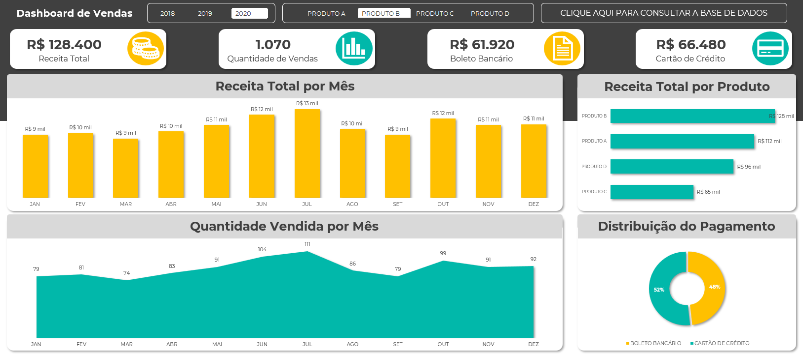 
        <figcaption>Report Vendas.</figcaption>
    </figure>

- [Simplifica Power Excel](https://github.com/PedroHeeger/main/blob/main/cert_ti/05-particip/data/power_bi/(23-05-22)%20Cert%20Power%20BI%20e%20Excel%20PH%20Simplifica%20Trein.pdf)
  - Plataforma: **Simplifica Treinamentos**   
  - [Pasta do Projeto](https://github.com/PedroHeeger/course/tree/main/simplifica_trein/power_bi/curso_043)
  - Aula 1 e 2
    
<figure>
         
        <figcaption>Report Atendimentos.</figcaption>
    </figure>

- [Simplifica Excel Express](../cert_ti/05-particip/data/excel/(23-06-17)%20Cert%20Excel%20PH%20Simplif%20Trein%20(Simplifica%20Express).pdf)
  - Plataforma: **Simplifica Treinamentos**   
  - [Pasta do Projeto](https://github.com/PedroHeeger/course/tree/main/simplifica_trein/excel/curso_059)
    
<figure>
        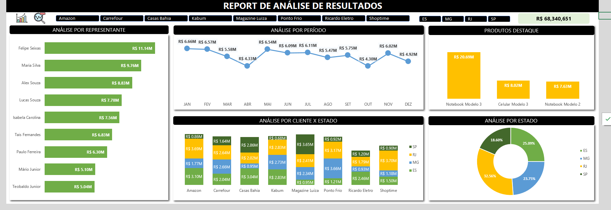 
        <figcaption>Report Vendas.</figcaption>
    </figure>

- [Semana do Excel](../cert_ti/05-particip/data/excel/(23-06-20)%20Cert%20Excel%20PH%20Hashtag%20Trein%20(Semana).pdf)
  - Plataforma: **Hashtag Treinamentos**   
  - [Pasta do Projeto](https://github.com/PedroHeeger/course/tree/main/hashtag/excel/curso_060)
    
<figure>
        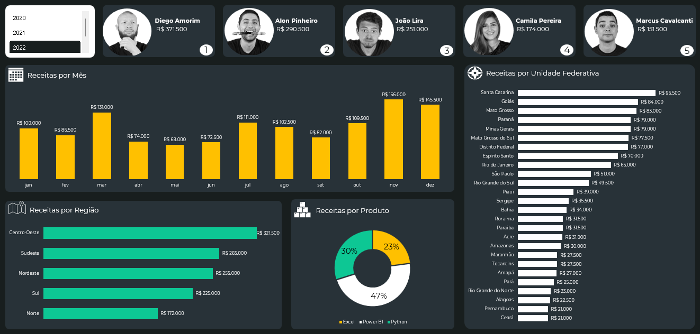 
        <figcaption>Report Vendas.</figcaption>
    </figure>

- [Semana do Excel na Prática](../cert_ti/05-particip/data/excel/(23-06-22)%20Cert%20Excel%20PH%20Empowerdata%20(Semana).pdf)
  - Plataforma: **Empowerdata**   
  - [Pasta do Projeto](https://github.com/PedroHeeger/course/tree/main/empowerdata/excel/curso_065)
    
<figure>
        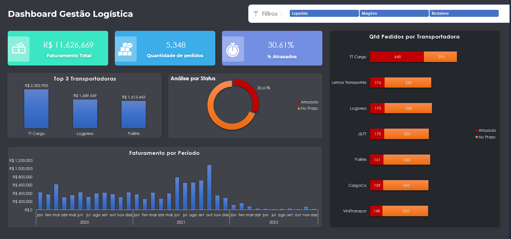 
        <figcaption>Report Logístico.</figcaption>
    </figure>

- [Imersão Excel](../cert_ti/05-particip/data/excel/(23-07-06)%20Cert%20Excel%20PH%20Karine%20Lago%20(Imersão).pdf)
  - Plataforma: **Karine Lago**   
  - [Pasta do Projeto](https://github.com/PedroHeeger/course/tree/main/outros/karine_lago/excel/curso_072)
    
<figure>
         
        <figcaption>Report Vendas.</figcaption>
    </figure>

---

<a name="item2"><h2>2. Power BI</h2></a>
[Back to summary](#item0)

- Intensivão de Power BI 2022
  - Plataforma: **Hashtag Treinamentos**   
  - [Pasta do Projeto](https://github.com/PedroHeeger/course/tree/main/hashtag/power_bi/curso_040)
  - Aula 1
    
<figure>
        <a href="https://app.powerbi.com/view?r=eyJrIjoiYmE4OWI5ZDYtNmNkYi00OGQyLWIxMzctYWVlNmJkYWUyZGMyIiwidCI6ImI1NTJmZWJlLWFkMjgtNGI4Ny1iZjI5LTFlODhiYmZkY2I4ZiJ9">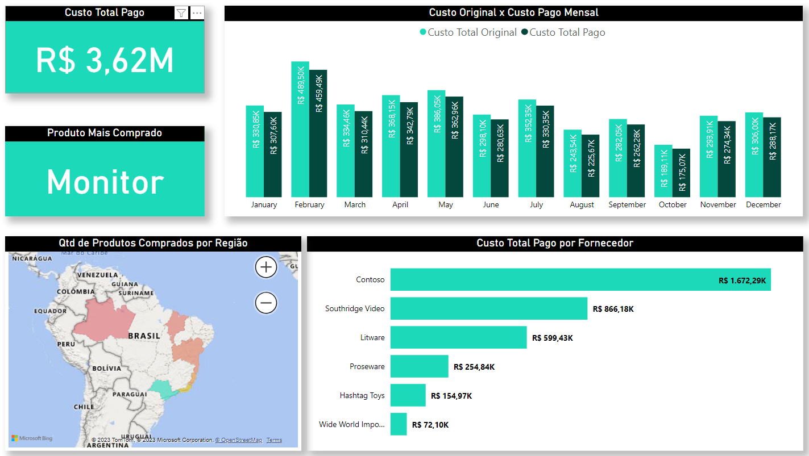 
        <figcaption>Report Compras.</figcaption></a>
    </figure>

  - Aula 2
    
<figure>
        <a href="https://app.powerbi.com/view?r=eyJrIjoiOTNiZTQ2YjYtODg3Mi00OGE2LTllMDEtYzE2MmMwOGI0Y2E3IiwidCI6ImI1NTJmZWJlLWFkMjgtNGI4Ny1iZjI5LTFlODhiYmZkY2I4ZiJ9">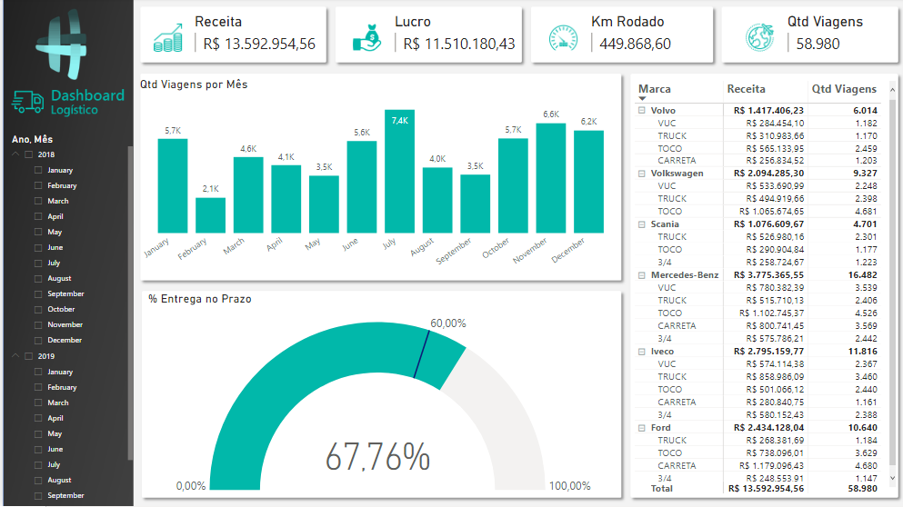 
        <figcaption>Report Logístico.</figcaption></a>
    </figure>

  - Aula 3
    
<figure>
        <a href="https://app.powerbi.com/view?r=eyJrIjoiMTRlOGVjY2QtNGEyMy00ZjY0LThkMTAtN2RjMTdhMTNmMzExIiwidCI6ImI1NTJmZWJlLWFkMjgtNGI4Ny1iZjI5LTFlODhiYmZkY2I4ZiJ9">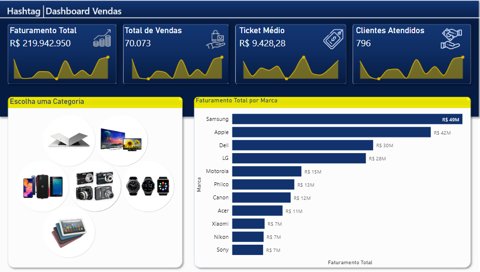 
        <figcaption>Report Vendas.</figcaption></a>
    </figure>

  - Aula 4
    
<figure>
        <a href="https://app.powerbi.com/view?r=eyJrIjoiYWUzN2Y1ZWItNWE2Yy00NGQzLWFjNjMtZWEwODI3YTNhNzlhIiwidCI6ImI1NTJmZWJlLWFkMjgtNGI4Ny1iZjI5LTFlODhiYmZkY2I4ZiJ9">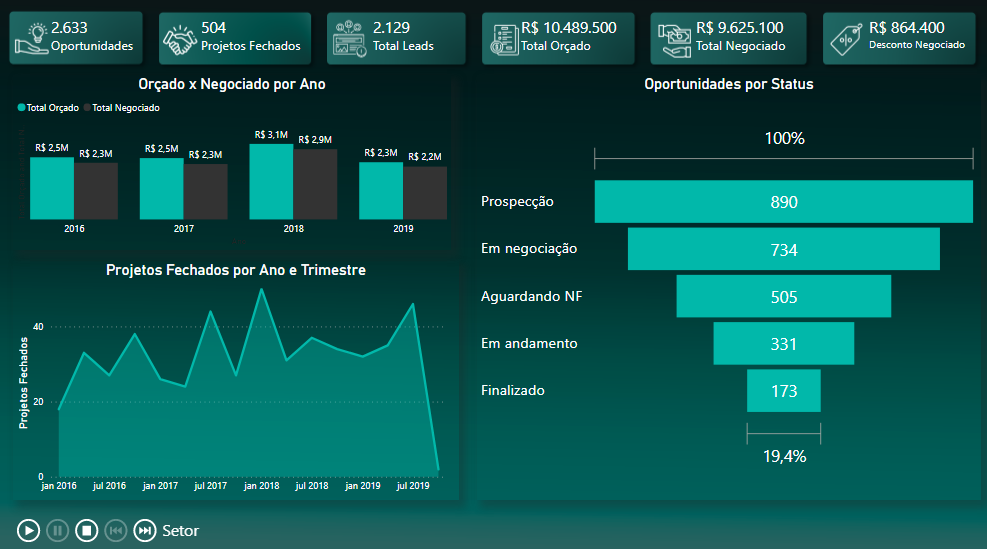 
        <figcaption>Report Projetos.</figcaption></a>
    </figure>

- [Intensivão de Power BI 2023](../cert_ti/05-particip/data/power_bi/(23-05-11)%20Cert%20Power%20BI%20PH%20Hashtag%20(Intensivão).pdf)
  - Plataforma: **Hashtag Treinamentos**   
  - [Pasta do Projeto](https://github.com/PedroHeeger/course/tree/main/hashtag/power_bi/curso_041)
  - Aula 1
    
<figure>
        <a href=" ">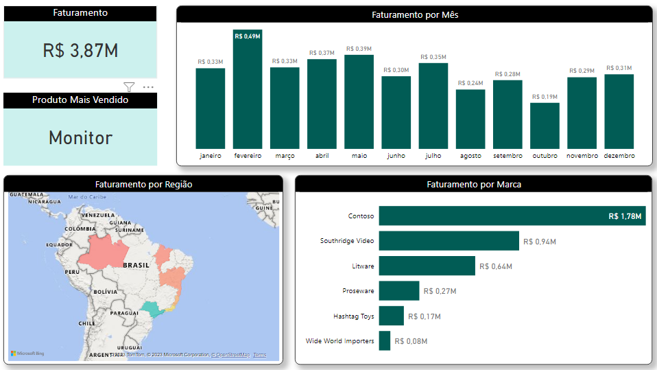 
        <figcaption>Report Vendas.</figcaption></a>
    </figure>

  - Aula 2
    
<figure>
        <a href=" "> 
        <figcaption>Report Produção.</figcaption></a>
    </figure>

  - Aula 3
    
<figure>
        <a href=" ">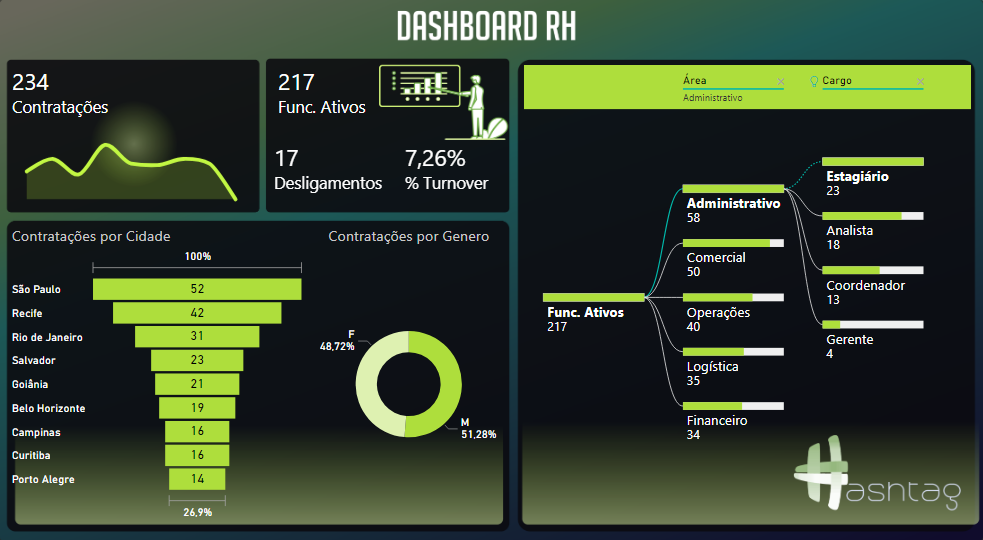 
        <figcaption>Report RH.</figcaption></a>
    </figure>

  - Aula 4
    
<figure>
        <a href=" ">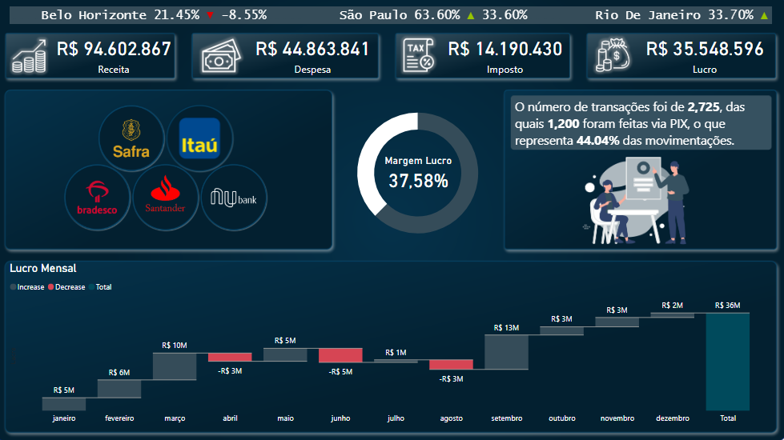 
        <figcaption>Report Financeiro.</figcaption></a>
    </figure>

- Minicurso Power BI 1
  - Plataforma: **Hashtag Treinamentos**   
  - [Pasta do Projeto](https://github.com/PedroHeeger/course/tree/main/hashtag/power_bi/curso_045)
    
<figure>
         
        <figcaption>Report Vendas.</figcaption>
    </figure>

- [Simplifica Power Excel](../cert_ti/05-particip/data/power_bi/(23-05-22)%20Cert%20Power%20BI%20e%20Excel%20PH%20Simplifica%20Trein.pdf)
  - Plataforma: **Simplifica Treinamentos**   
  - [Pasta do Projeto](https://github.com/PedroHeeger/course/tree/main/simplifica_trein/power_bi/curso_043)
  - Aula 3
    
<figure>
        <a href="https://app.powerbi.com/view?r=eyJrIjoiNDlkYmU5ZWMtODZjZS00NmE1LWFjZDktZmY5NjA1YTY2MGE3IiwidCI6ImI1NTJmZWJlLWFkMjgtNGI4Ny1iZjI5LTFlODhiYmZkY2I4ZiJ9">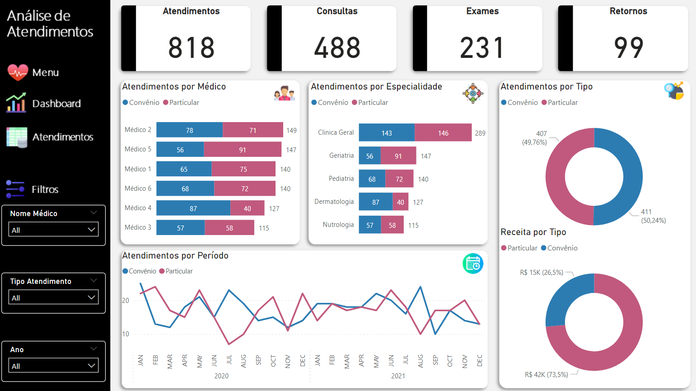 
        <figcaption>Report Atendimentos.</figcaption></a>
    </figure>

  - Aula 4
    
<figure>
        <a href="https://app.powerbi.com/view?r=eyJrIjoiNDRlNmU5NTMtYjk0ZC00NGI2LTkyYTMtZTdmOWQ2NjhiNDRkIiwidCI6ImI1NTJmZWJlLWFkMjgtNGI4Ny1iZjI5LTFlODhiYmZkY2I4ZiJ9"> 
        <figcaption>Report Vendas.</figcaption></a>
    </figure>

- Minicurso Power BI Experience
  - Plataforma: **Xperiun**   
  - [Pasta do Projeto](https://github.com/PedroHeeger/course/tree/main/xperiun/power_bi/curso_048)
    
<figure>
        <a href="https://app.powerbi.com/view?r=eyJrIjoiMTRkM2IyZmMtYmE4Ni00MGZmLWFkNmQtZDMwYzNmNzk3OGRjIiwidCI6ImI1NTJmZWJlLWFkMjgtNGI4Ny1iZjI5LTFlODhiYmZkY2I4ZiJ9">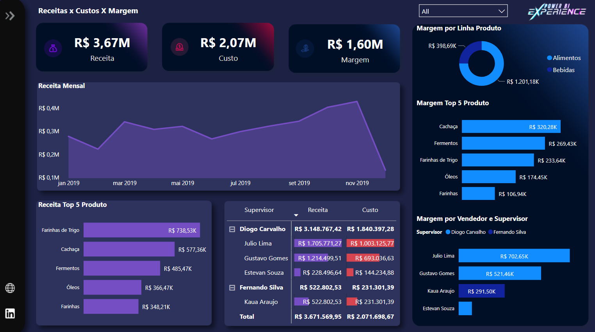 
        <figcaption>Report Vendas Modo Dark.</figcaption></a>
    </figure>

        
<figure>
        <a href="https://app.powerbi.com/view?r=eyJrIjoiMTRkM2IyZmMtYmE4Ni00MGZmLWFkNmQtZDMwYzNmNzk3OGRjIiwidCI6ImI1NTJmZWJlLWFkMjgtNGI4Ny1iZjI5LTFlODhiYmZkY2I4ZiJ9">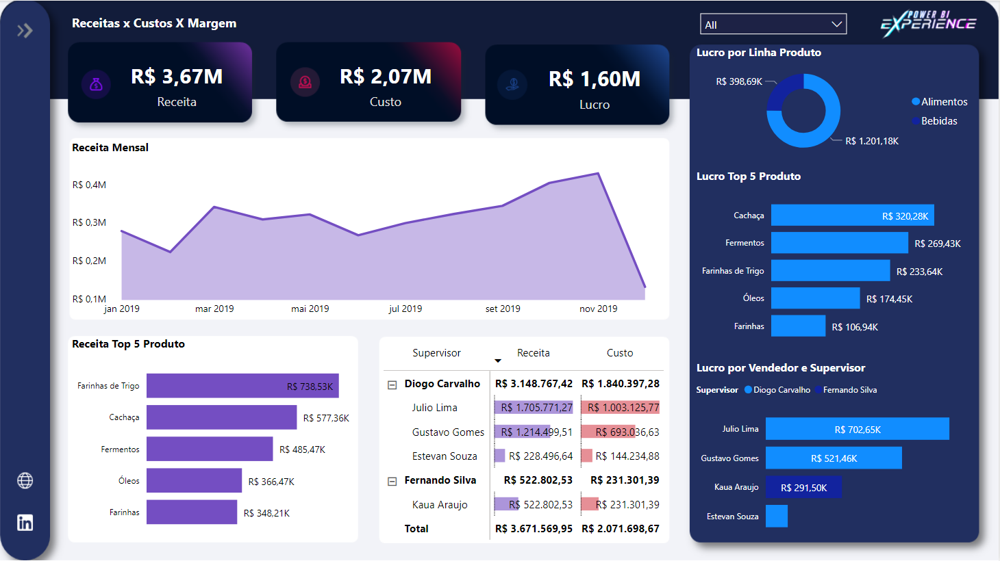 
        <figcaption>Report Vendas Modo Light.</figcaption></a>
    </figure>

- Desafio Missão ZERO - Bootcamp HPN
  - Plataforma: **Xperiun**   
  - [Pasta do Projeto](https://github.com/PedroHeeger/course/tree/main/xperiun/power_bi/curso_051)
    
<figure>
        <a href="https://app.powerbi.com/view?r=eyJrIjoiNTM1OGExYTItMjYwNi00ZWY1LThiMTAtODYyMmJlNWY2NDU3IiwidCI6ImI1NTJmZWJlLWFkMjgtNGI4Ny1iZjI5LTFlODhiYmZkY2I4ZiJ9"> 
        <figcaption>Report Vendas.</figcaption></a>
    </figure>

- Desafio Kickstart 1  | Atendimento Laboratorial
  - Plataforma: **Xperiun**   
  - [Pasta do Projeto](https://github.com/PedroHeeger/course/tree/main/xperiun/power_bi/curso_069)
    
<figure>
        <a href="https://app.powerbi.com/view?r=eyJrIjoiOGUyZjM5ZmQtYzE4Yy00YTYxLTg0YzMtMjgzMTYyN2U0MDhiIiwidCI6ImI1NTJmZWJlLWFkMjgtNGI4Ny1iZjI5LTFlODhiYmZkY2I4ZiJ9">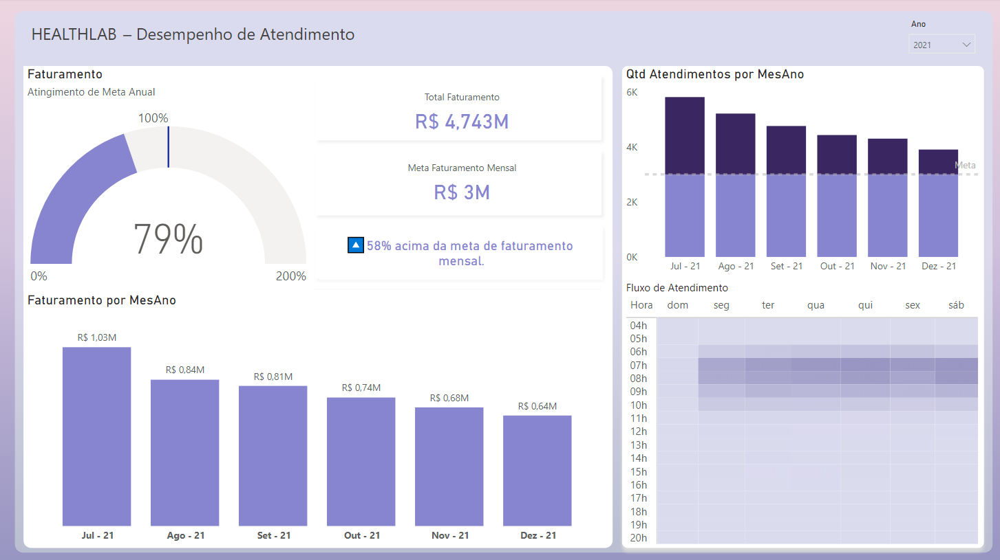 
        <figcaption>Report Vendas.</figcaption></a>
    </figure>

- [Acelerador de Carreira com Power BI](../cert_ti/05-particip/data/power_bi/(23-07-16)%20Cert%20Power%20BI%20PH%20Empowerdata%20(Acelerador%20de%20Carreiras).pdf)
  - Plataforma: **Empowerdata**   
  - [Pasta do Projeto](https://github.com/PedroHeeger/course/blob/main/empowerdata/power_bi/curso_073)
  - Aula 1
    
<figure>
        <a href="https://app.powerbi.com/view?r=eyJrIjoiYTAxY2YwMmEtZGIwZi00Y2EzLThmN2UtYTVlMmRjODEzY2QyIiwidCI6ImI1NTJmZWJlLWFkMjgtNGI4Ny1iZjI5LTFlODhiYmZkY2I4ZiJ9"> 
        <figcaption>Report Logístico.</figcaption></a>
    </figure>

  - Aula 2
    
<figure>
        <a href="https://app.powerbi.com/view?r=eyJrIjoiYjcxODVmNzEtMmU3MS00YTc4LTk0ZDUtZjc2YmI4NjdlYzEzIiwidCI6ImI1NTJmZWJlLWFkMjgtNGI4Ny1iZjI5LTFlODhiYmZkY2I4ZiJ9">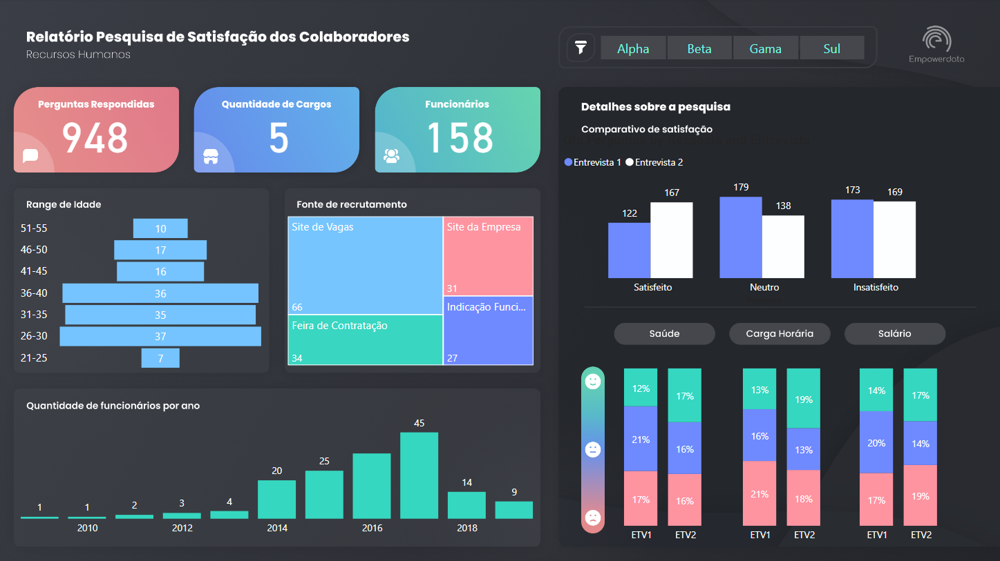 
        <figcaption>Report Recursos Humanos (RH).</figcaption></a>
    </figure>

  - Aula 3
    
<figure>
        <a href="https://app.powerbi.com/view?r=eyJrIjoiZGQ5Nzg0NzItODE3MC00NGI1LWI1NWUtMzI1ZDRmNzkwNjhkIiwidCI6ImI1NTJmZWJlLWFkMjgtNGI4Ny1iZjI5LTFlODhiYmZkY2I4ZiJ9"> 
        <figcaption>Report Vendas.</figcaption></a>
    </figure>

  - Aula 3 (Mobile)
    
<figure>
        <a href="https://app.powerbi.com/view?r=eyJrIjoiZGQ5Nzg0NzItODE3MC00NGI1LWI1NWUtMzI1ZDRmNzkwNjhkIiwidCI6ImI1NTJmZWJlLWFkMjgtNGI4Ny1iZjI5LTFlODhiYmZkY2I4ZiJ9">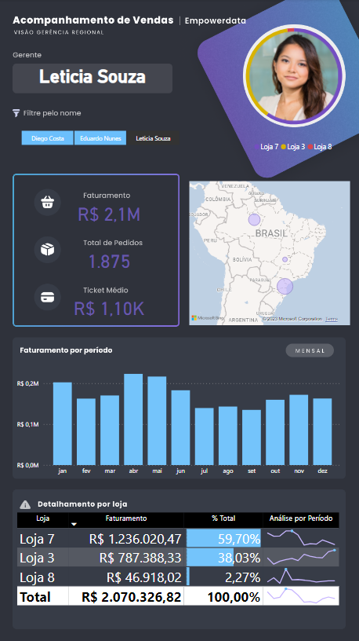 
        <figcaption>Report Vendas (Mobile).</figcaption></a>
    </figure>

- 002 - Desafio Kickstart | Filmes Netflix
  - Plataforma: **Xperiun**   
  - [Pasta do Projeto](https://github.com/PedroHeeger/course/tree/main/xperiun/power_bi/curso_074)
    
<figure>
        <a href="https://app.powerbi.com/view?r=eyJrIjoiY2I3Mzg5YTEtYTM2Ni00MTllLThlNjQtZTc3NDkzZTFkZDU0IiwidCI6ImI1NTJmZWJlLWFkMjgtNGI4Ny1iZjI5LTFlODhiYmZkY2I4ZiJ9">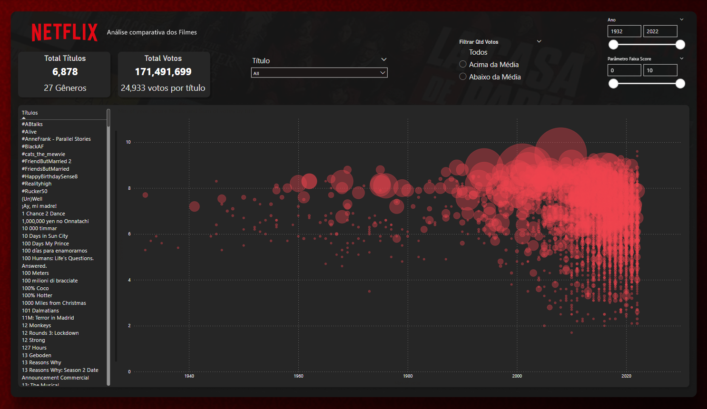 
        <figcaption>Report Avaliação de Títulos.</figcaption></a>
    </figure>

- [Simplifica Power BI](../cert_ti/05-particip/data/power_bi/)
  - Plataforma: **Simplifica Treinamentos**   
  - [Pasta do Projeto](https://github.com/PedroHeeger/course/tree/main/simplifica_trein/power_bi/curso_075)
  - Aula 1
    
<figure>
        <a href="https://app.powerbi.com/view?r=eyJrIjoiMDQ0MWEwNTMtZjQwMS00ODVhLWEyMGMtMGRlYTQ4ZTU5MWNlIiwidCI6ImI1NTJmZWJlLWFkMjgtNGI4Ny1iZjI5LTFlODhiYmZkY2I4ZiJ9&pageName=ReportSection"> 
        <figcaption>Report Vendas.</figcaption></a>
    </figure>

    
<figure>
        <a href="https://app.powerbi.com/view?r=eyJrIjoiMDQ0MWEwNTMtZjQwMS00ODVhLWEyMGMtMGRlYTQ4ZTU5MWNlIiwidCI6ImI1NTJmZWJlLWFkMjgtNGI4Ny1iZjI5LTFlODhiYmZkY2I4ZiJ9">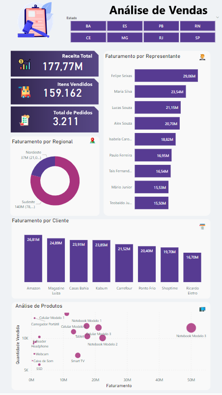 
        <figcaption>Report Vendas (Mobile).</figcaption></a>
    </figure>

  - Aula 2
    
<figure>
        <a href="https://app.powerbi.com/view?r=eyJrIjoiNWIxMzJhYzktNTk5Yy00NGM0LWI0Y2QtOGFlNzI2MDM0OTQ1IiwidCI6ImI1NTJmZWJlLWFkMjgtNGI4Ny1iZjI5LTFlODhiYmZkY2I4ZiJ9">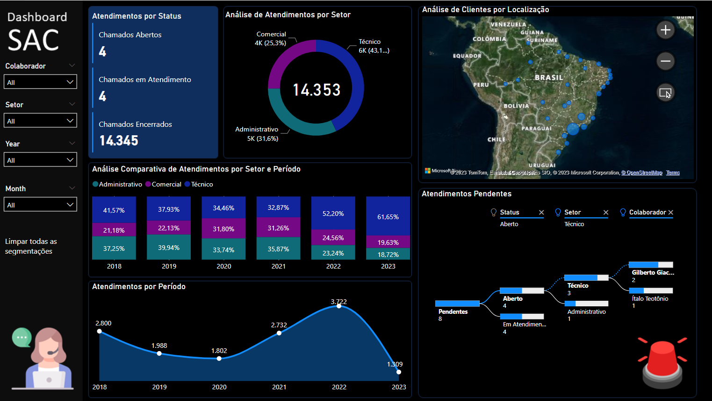 
        <figcaption>Report Atendimentos.</figcaption></a>
    </figure>

  - Aula 3
    
<figure>
        <a href="https://app.powerbi.com/view?r=eyJrIjoiMWZjZTIwNjktODQ3Ny00OTg2LWFlYjEtYzQ3MGMwMjM0NzhlIiwidCI6ImI1NTJmZWJlLWFkMjgtNGI4Ny1iZjI5LTFlODhiYmZkY2I4ZiJ9">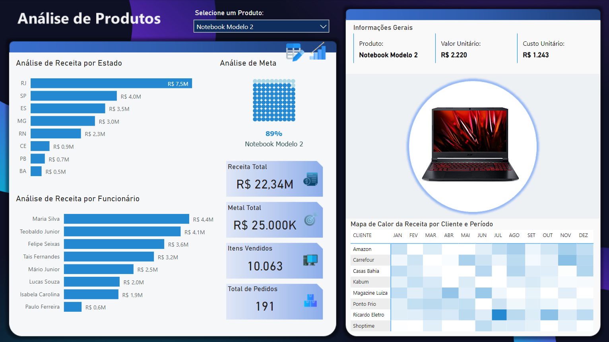 
        <figcaption>Report Vendas.</figcaption></a>
    </figure>

  - Aula 4
    
<figure>
        <a href="https://app.powerbi.com/view?r=eyJrIjoiY2Y5YTY4ODctZTA5Zi00Y2MyLThmMDYtMjE2MjI3Y2QwZDhmIiwidCI6ImI1NTJmZWJlLWFkMjgtNGI4Ny1iZjI5LTFlODhiYmZkY2I4ZiJ9"> 
        <figcaption>Report Análise de Perfil.</figcaption></a>
    </figure>

- [Semana Power BI](../cert_ti/05-particip/data/power_bi/)
  - Plataforma: **Cubo Três**   
  - [Pasta do Projeto](https://github.com/PedroHeeger/course/tree/main/cubo_tres/power_bi/curso_091)
  - Aula 1
    
<figure>
        <a href="https://app.powerbi.com/view?r=eyJrIjoiNDlhMDYxZjktZGQ1OS00M2E4LThmYTUtNzlkMzY1Zjc0NGRkIiwidCI6ImI1NTJmZWJlLWFkMjgtNGI4Ny1iZjI5LTFlODhiYmZkY2I4ZiJ9"> 
        <figcaption>Report Comercial.</figcaption></a>
    </figure>

  - Aula 2
    
<figure>
        <a href="https://app.powerbi.com/view?r=eyJrIjoiNDlhMDYxZjktZGQ1OS00M2E4LThmYTUtNzlkMzY1Zjc0NGRkIiwidCI6ImI1NTJmZWJlLWFkMjgtNGI4Ny1iZjI5LTFlODhiYmZkY2I4ZiJ9">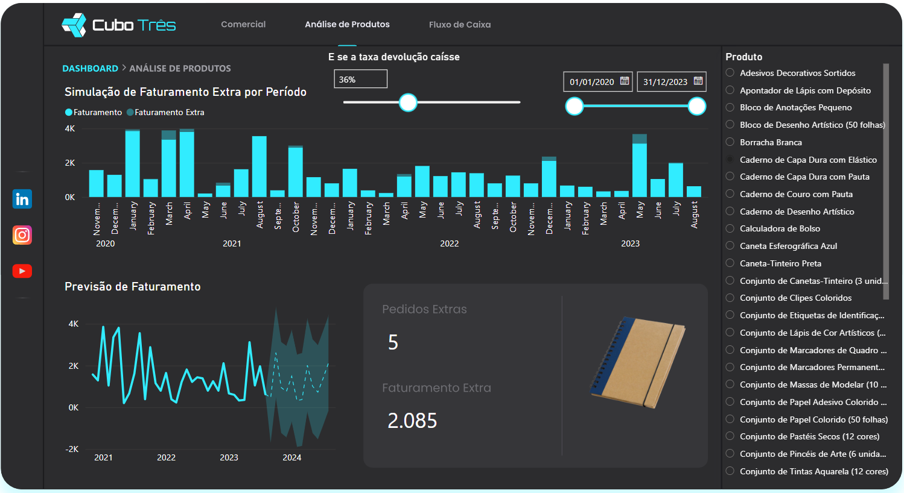 
        <figcaption>Report Análise de Produtos.</figcaption></a>
    </figure>

  - Aula 3
    
<figure>
        <a href="https://app.powerbi.com/view?r=eyJrIjoiNDlhMDYxZjktZGQ1OS00M2E4LThmYTUtNzlkMzY1Zjc0NGRkIiwidCI6ImI1NTJmZWJlLWFkMjgtNGI4Ny1iZjI5LTFlODhiYmZkY2I4ZiJ9">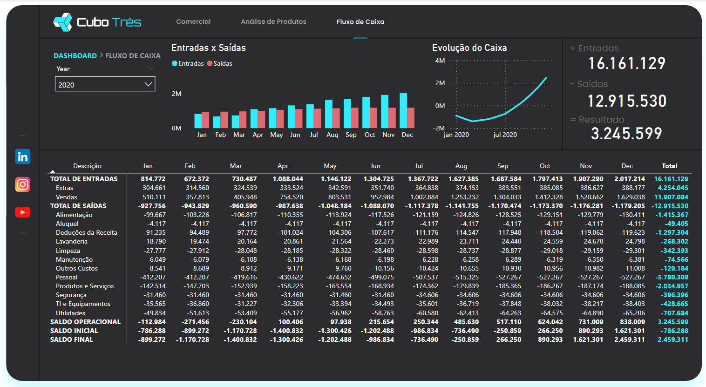 
        <figcaption>Report Fluxo de Caixa.</figcaption></a>
    </figure>

---

<a name="item3"><h2>3. Outros</h2></a>
[Back to summary](#item0)

- Report 1
    
<figure>
         
        <figcaption>Report Compras Layout 1.</figcaption>
    </figure>

    
<figure>
        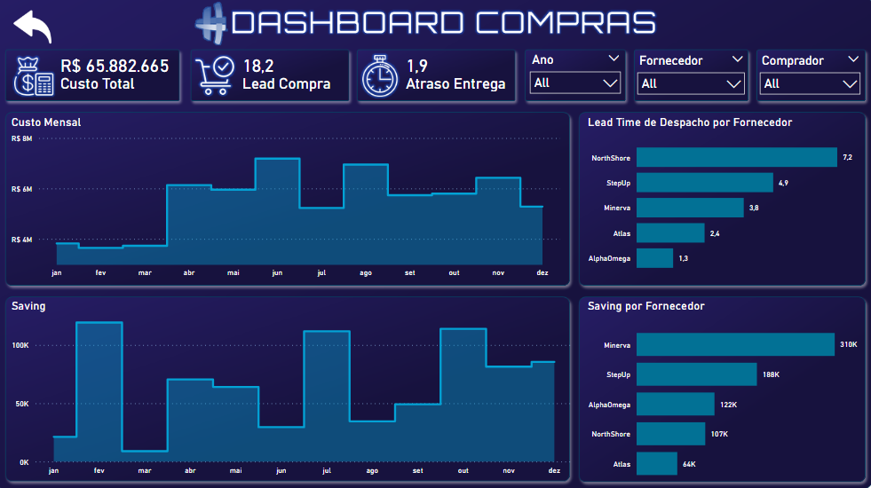 
        <figcaption>Report Compras Layout 2.</figcaption>
    </figure>

- Report 2
    
<figure>
         
        <figcaption>Report Fluxo de Caixa.</figcaption>
    </figure>

- Report 3
    
<figure>
         
        <figcaption>Report Investimentos.</figcaption>
    </figure>

- Report 4
    
<figure>
         
        <figcaption>Report Produção.</figcaption>
    </figure>

- Report 5
    
<figure>
        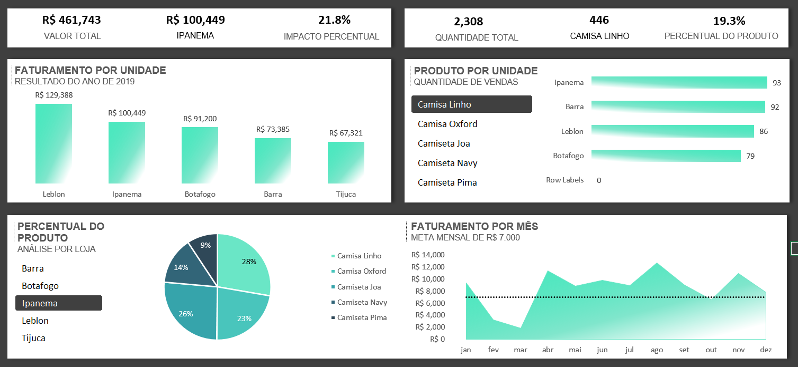 
        <figcaption>Report Vendas.</figcaption>
    </figure>

- Report 6
    
<figure>
        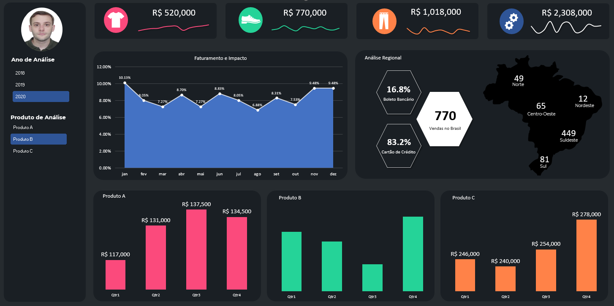 
        <figcaption>Report Vendas.</figcaption>
    </figure>
